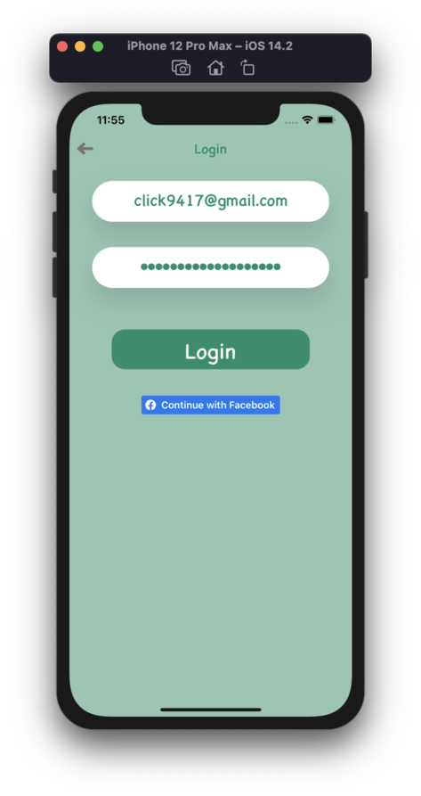

# Plant Baby Monitor iOS

# Introduction
Many young professionals travel often and have to leave their plant babies unattended. Timers and naive remote watering systems are incomplete solutions as excess soil moisture can be harmful to plants according to the Sensoterra index. In addition to remote watering, Plant Baby Monitor app monitors the plant’s state and environment. Contact developers:

- iOT and REST API: yohan.derose@monash.edu

- iOS: farhad.rezwan@gmail.com

# Functionality
#### IOT component
1. Pi to turns on an output GPIO connected component
2. Circuit with humidity, temperature and soil moisture sensors to Pi and read input
#### REST API
3. Allow Pi to host a server that 
4. pushes current plant state to remote storage (Firebase)
5. Remotely activates a pump motor
#### User iOS application
6. Implement User Authentication and Plant storage with firebase
7. Create plant data visualisation using third-party libraries
8. Implement button that activates the pump remotely

# Screens

## 1. Spash Screen
### Spash Screen Landscape Dark

### Spash Screen Light

## 2. Welcome Screen

## 3. Login Screen

## 4. Regisration Screen

## 5. About Screen
### Sample About Screens

 

## 6. Chart Screen
### Sample Chart Screens

## 7. Edit Plant Screen
### Sample Edit Plant Screens

## 8. Add Plant Screen
### Sample Add Plant Screens

